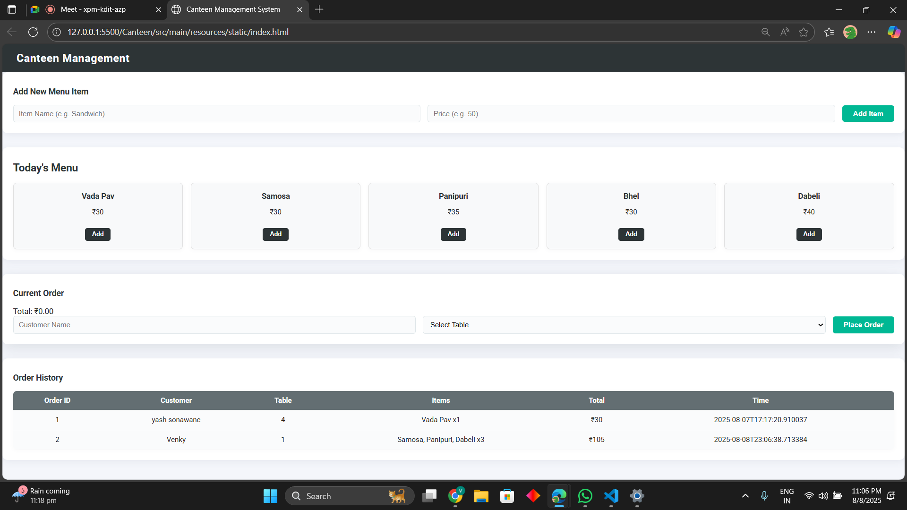

# 🍽️ CANTEEN MANAGEMENT SYSTEM

The **Canteen Management System** is a **Spring Boot web application** using **Spring Data JPA** and **PostgreSQL**.
It enables administrators to manage the menu, place customer food orders, and view order history efficiently.
Built with Maven and a clean modular design, the system provides a **modern responsive frontend** with HTML, CSS, and JavaScript.

It allows users to interact with the system through a simple and intuitive **web-based interface**.

---

# ✨ FEATURES

* **ADD NEW MENU ITEM** – Insert new food items with price.
* **VIEW AVAILABLE MENU** – Display all canteen items with prices.
* **PLACE FOOD ORDER** – Customers can order items by entering name and table number.
* **VIEW ORDER HISTORY** – Shows all past orders with customer details, ordered items, and total amount.
* **DATABASE PERSISTENCE WITH SPRING DATA JPA** – All menu items and orders are stored in PostgreSQL.
* **RESPONSIVE WEB UI** – Modern HTML/CSS/JS interface that works across devices.

---

# 🛠 TECHNOLOGIES USED

* **Java 17+** – Backend development with Spring Boot.
* **Spring Boot 3.x** – Rapid application development with embedded server.
* **Spring Data JPA** – ORM-based database operations.
* **PostgreSQL 15+** – Relational database for storing menu and orders.
* **Maven 3.8.6+** – Build automation and dependency management.
* **HTML5, CSS3, JavaScript** – Modern, responsive frontend.

---

# 📦 DEPENDENCIES

```xml
<dependency>
    <groupId>org.springframework.boot</groupId>
    <artifactId>spring-boot-starter-data-jpa</artifactId>
</dependency>

<dependency>
    <groupId>org.springframework.boot</groupId>
    <artifactId>spring-boot-starter-web</artifactId>
</dependency>

<dependency>
    <groupId>org.postgresql</groupId>
    <artifactId>postgresql</artifactId>
    <scope>runtime</scope>
</dependency>
```

---

# 📄 APPLICATION PROPERTIES

```properties
spring.datasource.url=jdbc:postgresql://localhost:5432/canteen
spring.datasource.username=postgres
spring.datasource.password=2007

spring.jpa.hibernate.ddl-auto=update
spring.jpa.show-sql=false
spring.jpa.properties.hibernate.dialect=org.hibernate.dialect.PostgreSQLDialect
```

---

# 🖥 PREREQUISITES

* ✅ **Java JDK 17+**
* ✅ **PostgreSQL 15+**
* ✅ **Apache Maven 3.8.6+**
* ✅ **IDE** like VS Code / IntelliJ IDEA / Eclipse
* ✅ **Web Browser** (Google Chrome recommended)

---

# 🗄 DATABASE SETUP

```sql
CREATE DATABASE canteen;
```

(Spring Boot will auto-create tables on first run.)

---

# 📂 PROJECT STRUCTURE

```bash
📦 CANTEEN
└── 📁 src
    └── 📁 main
        ├── 📁 java
        │   └── 📁 com
        │       └── 📁 example
        │           └── 📁 Canteen
        │               ├── 📄 CanteenApplication.java
        │               ├── 📄 CanteenController.java
        │               ├── 📄 CanteenService.java
        │               ├── 📄 MenuItem.java
        │               ├── 📄 MenuRepository.java
        │               ├── 📄 OrderItem.java
        │               └── 📄 OrderRepository.java
        ├── 📁 resources
        │   ├── 📁 static
        │   │   └── 📄 index.html
        │   ├── 📁 templates
        │   └── 📄 application.properties
        └── 📁 test
            └── 📁 java
                └── 📁 com
                    └── 📁 example
                        └── 📁 Canteen
                            └── 📄 CanteenApplicationTests.java
```

---

# ▶️ HOW TO RUN

```bash
# Clone repository
git clone <repo-url>
cd CANTEEN

# Run application
mvn clean spring-boot:run
```

Open [http://localhost:8080](http://localhost:8080) in your browser.

---

# 📬 CONTACT

* **Developer:** Vinayak Sonawane
* **Developer:**Abhishek Mhetre
* **Email:** [vinayaksonawane377@gmail.com]
* **GitHub:** [Vinayak07032007]
---

# 📷 SCREENSHOTS




---


